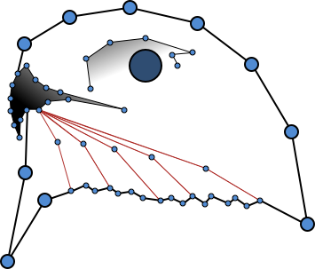

# `buzzard`

In a nutshell, `buzzard` reads and writes geospatial raster and vector data.

<div align="center">
  <br><br>
</div>

[](https://github.com/airware/asl-validator/blob/master/LICENSE)
[](https://circleci.com/gh/airware/buzzard/tree/master)
[](https://codecov.io/gh/airware/buzzard)

Table of Contents
-----------------
+ [buzzard is](#buzzard-is)
+ [buzzard contains](#buzzard-contains)
+ [Simple example](#simple-example)
+ [Advanced (and fun) examples](#advanced-and-fun--examples)
+ [Features](#features)
+ [Future features summary](#future-features-summary)
+ [Dependencies](#dependencies)
+ [How to install](#how-to-install)
  + [Manually](#manually)
  + [Anaconda](#anaconda)
+ [How to test](#how-to-test)
+ [Contributions and feedback](#contributions-and-feedback)
+ [License and Notice](#license-and-notice)
+ [Other pages](#other-pages)

## `buzzard` is
- a python library
- a `gdal`/`ogr`/`osr` wrapper
- designed to hide all cumbersome operations while working with GIS files
- designed for data science workflows
- under active development (see [`TODO`](https://github.com/airware/buzzard/wiki/TODO))
- tested with `pytest` in python 2.7 and python 3.6

## `buzzard` contains
- a class to open/read/write/create GIS files: [`DataSource`](./buzzard/_datasource.py)
- classes to interact with opened files: [`RasterPhysical`](./buzzard/_raster_physical.py) [`Vector`](./buzzard/_vector.py)
- a toolbox class designed to locate a rectangle in both image space and geometry space: [`Footprint`](./buzzard/_footprint.py)

## Simple example
This example illustrates visualization of a raster based on polygons.

```py
import buzzard as buzz
import numpy as np
import matplotlib.pyplot as plt

rgb_path = 'path/to/raster.file'
polygons_path = 'path/to/vector.file'

ds = buzz.DataSource()
ds.open_raster('rgb', rgb_path)
ds.open_vector('polygons', polygons_path)

# Iterate over the polygons as shapely objects
for poly in ds.polygons.iter_data(None):

    # Compute the Footprint bounding poly
    fp = ds.rgb.fp.intersection(poly)

    # Read rgb at `fp` to a numpy array
    rgb = ds.rgb.get_data(band=(1, 2, 3), fp=fp).astype('uint8')
    alpha = ds.rgb.get_data(band=4, fp=fp).astype('uint8')

    # Create a boolean mask as a numpy array from a shapely polygon
    mask = np.invert(fp.burn_polygons(poly))

    # Darken pixels outside of polygon, set nodata pixels to red
    rgb[mask] = (rgb[mask] * 0.5).astype(np.uint8)
    rgb[alpha == 0] = [255, 0, 0]

    plt.imshow(rgb)
    plt.show()
```

## Advanced (and fun 😊) examples
Additional examples can be found here: [jupyter notebook](./doc/examples.ipynb).

## Features
- Raster and vector files opening
- Raster and vector files reading to `numpy.ndarray`, `shapely` objects, `geojson` and raw coordinates
- Raster and vector files writing from `numpy.ndarray`, `shapely` objects, `geojson` and raw coordinates
- Raster and vector files creation
- Powerful manipulations of raster windows
- Spatial reference homogenization between opened files like a `GIS software`

## Future features summary
- Wheels with `osgeo` binaries included
- Advanced spatial reference homogenization using `gdal` warping functions
- More tools, syntaxes and algorithms to work with raster datasets that don't fit in memory
- Strong support of non north-up / west-left footprints
- Data visualization tools
- Strong performance improvements
- Floating point precision loss handling improvements

## Dependencies

The following table lists dependencies along with the minimum version, their status for the project and the related license.

| Library       | Version  | Last     | Mandatory | License                                                                        | Comment                                                       |
|---------------|----------|----------|-----------|--------------------------------------------------------------------------------|---------------------------------------------------------------|
| gdal          | >=2.1.3  | 2.2.2    | Yes       | [MIT/X](https://github.com/OSGeo/gdal/blob/trunk/gdal/LICENSE.TXT)             | Hard to install. Will be included in `buzzard` wheels         |
| opencv-python | >=3.1.0  | 3.3.0.10 | Yes       | [3-clause BSD](http://opencv.org/license.html)                                 | Easy to install with `opencv-python` wheels. Will be optional |
| shapely       | >=1.6.1  | 1.6.1    | Yes       | [3-clause BSD](https://github.com/Toblerity/Shapely/blob/master/LICENSE.txt)   |                                                               |
| affine        | >=2.0.0  | 2.1.0    | Yes       | [3-clause BSD](https://github.com/sgillies/affine/blob/master/LICENSE.txt)     |                                                               |
| numpy         | >=1.13.0 | 1.13.1   | Yes       | [numpy](https://docs.scipy.org/doc/numpy-1.10.0/license.html)                  |                                                               |
| scipy         | >=0.19.1 | 0.19.1   | Yes       | [scipy](https://www.scipy.org/scipylib/license.html)                           |                                                               |
| pint          | >=0.8.1  | 0.8.1    | Yes       | [3-clause BSD](https://github.com/hgrecco/pint/blob/master/LICENSE)            |                                                               |
| six           | >=1.11.0 | 1.11.0   | Yes       | [MIT](https://github.com/benjaminp/six/blob/master/LICENSE)                    |                                                               |
| chainmap      | >=1.0.2  | 1.0.2    | Yes       | [Python 2.7 license](https://bitbucket.org/jeunice/chainmap)                   | Only for python <3.2                                          |
| pytest        | >=3.2.2  | 3.2.2    | No        | [MIT](https://docs.pytest.org/en/latest/license.html)                          | Only for tests                                                |
| attrdict      | >=2.0.0  | 2.0.0    | Yes       | [MIT](https://github.com/bcj/AttrDict/blob/master/LICENSE.txt)                 |                                                               |
| geopandas     |          | 0.3.0    | No        | [3-clause BSD](https://github.com/geopandas/geopandas/blob/master/LICENSE.txt) | Future dependency. Will be optional                           |

## How to install

### Package manager and pip
```sh
# Install GDAL
# Windows: http://www.lfd.uci.edu/~gohlke/pythonlibs/#gdal
# MacOS: brew install gdal && brew tap osgeo/osgeo4mac && brew tap --repair && brew install gdal2 && export PATH="/usr/local/opt/gdal2/bin:$PATH" && pip install 'gdal==2.1.3'
# Ubuntu: apt-get install python-gdal=2.1.3+dfsg-1~xenial2 libproj-dev libgdal-dev gdal-bin

# Install buzzard
pip install buzzard
```

### Anaconda and pip
```sh
# Install Anaconda
# https://www.anaconda.com/download/

# Create env
conda create -n buzz python=3.6 gdal opencv scipy shapely -c 'conda-forge'

# Activate env
# Windows: activate buzz
# Linux, MacOS: source activate buzz

# Install buzzard
pip install buzzard
```

## How to test
```sh
git clone https://github.com/airware/buzzard
pip install -r buzzard/requirements-dev.txt
pytest buzzard/buzzard/test
```

## Documentation
Hosted soon, in the meantime
- look at docstrings in code
- get familiar with the [public classes](https://github.com/airware/buzzard/wiki/Public-classes)
- play with the exemples in [examples.ipynb](./doc/examples.ipynb)

## Contributions and feedback
Welcome to the `buzzard` project! We appreciate any contribution and feedback, your proposals and pull requests will be considered and responded to. For more information, see the [`CONTRIBUTING.md`](./CONTRIBUTING.md) file.

## Authors
See [AUTHORS](./AUTHORS.md)

## License and Notice
See [LICENSE](./LICENSE) and [NOTICE](./NOTICE).

## Other pages
- [examples](./doc/examples.ipynb)
- [public-classes](https://github.com/airware/buzzard/wiki/Public-classes)
- [wiki](https://github.com/airware/buzzard/wiki)
- [todo](https://github.com/airware/buzzard/wiki/TODO)

------------------------------------------------------------------------------------------------------------------------
